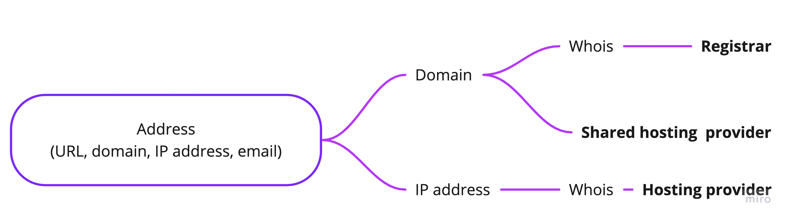

# abuse_whois

[](https://badge.fury.io/py/abuse-whois)
[](https://github.com/ninoseki/abuse_whois/actions/workflows/test.yml)
[](https://coveralls.io/github/ninoseki/abuse_whois?branch=main)

Yet another way to find where to report an abuse.



This tool is highly inspired from the following libraries:

- https://github.com/bradleyjkemp/abwhose
- https://github.com/certsocietegenerale/abuse_finder

## Requirements

- Python 3.10+

## Installation

```bash
pip install abuse_whois

# or if you want to use built-in REST API
pip install abuse_whois[api]
```

## Usage

### As a library

```python
from abuse_whois import get_abuse_contacts

await get_abuse_contacts("1.1.1.1")
await get_abuse_contacts("github.com")
await get_abuse_contacts("https://github.com")
await get_abuse_contacts("foo@example.com")
```

### As a CLI tool

```bash
$ abuse_whois 1.1.1.1 | jq .
```

### As a REST API

```bash
$ uvicorn abuse_whois.api.main:app
INFO:     Started server process [2283]
INFO:     Waiting for application startup.
INFO:     Application startup complete.
INFO:     Uvicorn running on http://127.0.0.1:8000 (Press CTRL+C to quit)

$ http localhost:8000/api/whois/ address=https://github.com
```

### With Docker

```bash
git clone https://github.com/ninoseki/abuse_whois
cd abuse_whois
docker build . -t abuse-whois
docker run -i -d -p 8000:8000 abuse-whois
```

## Settings

All settings can be done via environment variables or `.env` file.

| Name                                       | Type                  | Default  | Desc.                                                    |
| ------------------------------------------ | --------------------- | -------- | -------------------------------------------------------- |
| WHOIS_LOOKUP_TIMEOUT                       | int                   | 10       | Timeout value for whois lookup (seconds)                 |
| WHOIS_LOOKUP_CACHE_SIZE                    | int                   | 1024     | Cache size for whois lookup                              |
| WHOIS_LOOKUP_CACHE_TTL                     | int                   | 3600     | Cache TTL value for whois lookup (seconds)               |
| WHOIS_LOOKUP_MAX_RETRIES                   | int                   | 3        | Max retries on timeout error                             |
| IP_ADDRESS_LOOKUP_TIMEOUT                  | int                   | 10       | Timeout value for IP address lookup (seconds)            |
| IP_ADDRESS_LOOKUP_CACHE_SIZE               | int                   | 1024     | Cache size for IP address lookup                         |
| IP_ADDRESS_LOOKUP_CACHE_TTL                | int                   | 3600     | Cache TTL value for IP address lookup (seconds)          |
| RULE_EXTENSIONS                            | CommaSeparatedStrings | yaml,yml | Rule file extensions                                     |
| ADDITIONAL_WHOIS_RULE_DIRECTORIES          | CommaSeparatedStrings |          | Additional directories contain whois rule files          |
| ADDITIONAL_SHARED_HOSTING_RULE_DIRECTORIES | CommaSeparatedStrings |          | Additional directories contain shared hosting rule files |

## Contributions

`abuse_whois` works based on a combination of static rules and a parsing result of whois response.

- Rules:
  - [Registrar and hosting provider](https://github.com/ninoseki/abuse_whois/wiki/Registrar-and-Hosting-Provider)
  - [Shared hosting provider](https://github.com/ninoseki/abuse_whois/wiki/Shared-Hosting)

Please submit a PR (or submit a feature request) if you find something missing.
